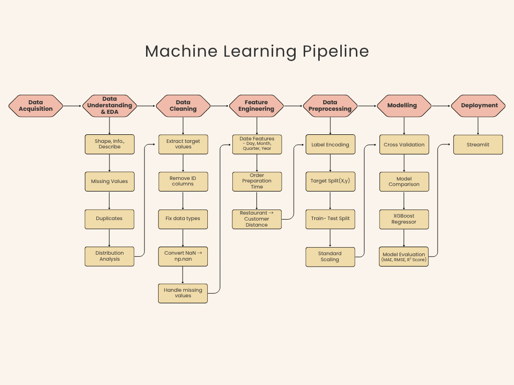

# Intelligent Food Delivery ETA Prediction Platform

A complete end-to-end Machine Learning project that predicts the Estimated Time of Arrival (ETA) for food delivery orders based on delivery partner details, weather conditions, traffic, city, order information, and engineered features.

The project demonstrates the complete ML workflow, including data preprocessing, feature engineering, model training, evaluation, deployment using Streamlit, and interactive prediction through a web application.

---

## 🚀 Live Demo

> [Intelligent Food Delivery ETA Prediction Platform](https://intelligent-food-delivery-eta-prediction-platform.streamlit.app/)
---

## 📌 Problem Statement

Food delivery companies require accurate delivery time estimation to improve customer satisfaction and optimize logistics.

This project predicts the expected delivery time using historical delivery data and Machine Learning regression models.

---

# Features

- Complete Data Preprocessing Pipeline
- Feature Engineering
- Multiple Regression Models
- Model Comparison
- Best Model Selection
- Interactive Streamlit Web App
- Model Serialization using Joblib
- Clean Modular Project Structure

---

# Dataset

The dataset contains information about:

- Delivery Person Details
- Weather Conditions
- Road Traffic Density
- Vehicle Information
- Order Type
- City
- Festival Status
- Restaurant Location
- Delivery Location
- Order Time
- Pickup Time
- Delivery Time (Target Variable)

Target Variable

```
Time_taken(min)
```
---

# Project Structure

```
Intelligent-Food-Delivery-ETA-Prediction-Platform/

│── app.py
│── model_training.py
│── preprocessing.py
│── predict.py
│── Food_Delivery_ETA_Prediction.ipynb
│── dataset.csv
│── model.pkl
│── scaler.pkl
│── encoders.pkl
│── feature_names.pkl
│── model_results.csv
│── requirements.txt
│── README.md
│── .gitignore
```

---

# Machine Learning Pipeline



---

# Feature Engineering

Several new features were created from the raw dataset.

Examples include:

- Delivery Distance
- Order Preparation Time
- Day
- Month
- Quarter
- Year
- Day of Week
- Weekend Indicator
- Month Start
- Month End
- Quarter Start
- Quarter End
- Year Start
- Year End
- City Code Extraction

---

# Models Implemented

The following regression models were trained and compared.

- Linear Regression
- Decision Tree Regressor
- Random Forest Regressor
- XGBoost Regressor

The best-performing model was selected based on evaluation metrics.

---

# Evaluation Metrics

Models were evaluated using:

- Mean Absolute Error (MAE)
- Root Mean Squared Error (RMSE)
- R² Score

Comparison:

| Model               | MAE    | RMSE   | R² Score |
|---------------------|-------:|-------:|---------:|
| Linear Regression   | 5.6210 | 7.0421 | 0.4344   |
| Decision Tree       | 4.2302 | 5.6152 | 0.6404   |
| Random Forest       | 3.1967 | 4.0501 | 0.8129   |
| XGBoost             | 3.1476 | 3.9698 | 0.8203   |

---

# Technologies Used

### Programming Language

- Python

### Libraries

- Pandas
- NumPy
- Scikit-learn
- XGBoost
- Joblib
- Geopy
- Matplotlib
- Streamlit

---

# Streamlit Application

The deployed application allows users to enter:

- Delivery Person Age
- Delivery Rating
- Weather
- Traffic Density
- Vehicle Type
- City
- Festival
- Multiple Deliveries
- Delivery Distance
- Preparation Time

The trained Machine Learning model predicts the estimated delivery time instantly.

---

# Screenshots

## Home Page

> Add screenshot here

```
screenshots/home.png
```

---

## Prediction Result

> Add screenshot here

```
screenshots/prediction.png
```

---

# Installation

Clone the repository

```bash
git clone https://github.com/abhi123dev/Intelligent-Food-Delivery-ETA-Prediction-Platform.git
```

Create Virtual Environment

```bash
python -m venv venv
```

Activate Environment

### Windows

```bash
venv\Scripts\activate
```

### Linux/Mac

```bash
source venv/bin/activate
```

Install dependencies

```bash
pip install -r requirements.txt
```

---

# Train the Model

Run

```bash
python model_training.py
```

This generates

```
model.pkl
scaler.pkl
encoders.pkl
feature_names.pkl
model_results.csv
```

---

# Run the Streamlit App

```bash
streamlit run app.py
```

---

# Project Workflow

```
Raw Dataset
      │
      ▼
Data Cleaning
      │
      ▼
Feature Engineering
      │
      ▼
Encoding
      │
      ▼
Model Training
      │
      ▼
Model Evaluation
      │
      ▼
Model Saving
      │
      ▼
Prediction API
      │
      ▼
Streamlit Web App
```

---

# Future Improvements

- Hyperparameter Tuning using GridSearchCV
- Automatic Distance Calculation using GPS Coordinates
- Real-time Weather API Integration
- Live Traffic API Integration
- Interactive Map Visualization
- Docker Deployment
- CI/CD Pipeline
- Cloud Deployment using AWS or Azure
- Explainable AI using SHAP

---

# Repository Contents

| File | Description |
|------|-------------|
| app.py | Streamlit web application |
| preprocessing.py | Data cleaning and feature engineering |
| model_training.py | Model training and evaluation |
| predict.py | Prediction pipeline |
| Food_Delivery_ETA_Prediction.ipynb | Complete notebook with EDA, preprocessing, training, and evaluation |
| dataset.csv | Dataset |
| model.pkl | Trained model |
| scaler.pkl | StandardScaler object |
| encoders.pkl | Saved LabelEncoders |
| feature_names.pkl | Feature order used during inference |
| model_results.csv | Model comparison metrics |

---

# Learning Outcomes

This project demonstrates:

- End-to-End Machine Learning Pipeline
- Data Cleaning
- Feature Engineering
- Regression Modeling
- Model Comparison
- Model Serialization
- Streamlit Deployment
- Production-style Project Structure

---

# Author

**Abhijeet Dewanda**

- IIT Bombay
- Machine Learning | Data Science | AI

---

# License

This project is intended for educational and portfolio purposes.
